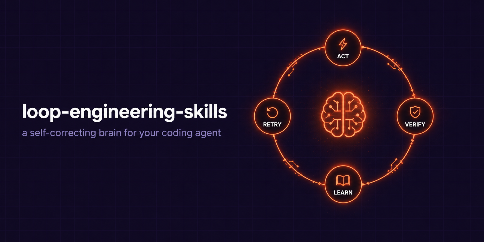

# loop-engineering-skills



> **Your coding agent says "done." This makes it prove it.**

AI agents ship silent bugs, treat your requirements as suggestions, and
repeat yesterday's mistakes. This repo is the fix — a self-correcting brain
installed in 60 seconds: verification gates written *before* the code,
memory that learns from every failure, and correction loops that actually
work (naive "double-check yourself" is proven to make output *worse*).


Loop engineering is the trending idea (Addy Osmani, Boris Cherny, Cobus
Greyling): stop prompting agents, design the loops that prompt them. This
repo is the part you can run today — the loop's brain, pre-built.

## Quick start (60 seconds)

```bash
git clone https://github.com/haidrrrry/loop-engineering-skills
cd /path/to/your-project
bash /path/to/loop-engineering-skills/install.sh   # installs into the current directory
.loop/bin/loop.sh "add input validation to the signup form"
```

That's it. The agent now runs: **act → verify against your gates → record
the lesson → retry on failure → escalate to you when stuck.** Requires
[Claude Code](https://code.claude.com). No Claude? The same loops work as
copy-paste prompts in any AI: [`prompts/copy-paste-loops.md`](prompts/copy-paste-loops.md).

## Why this exists

Research on coding agents found the most dangerous failures are *silent* —
the code runs, but doesn't do what you asked — and that agents treat your
requirements as suggestions, not rules. Meanwhile, the obvious fix ("hey AI,
double-check your work") is proven to backfire: without an external anchor,
models un-fix correct answers more often than they catch real errors
(Huang et al., ICLR 2024).

The fix that holds up in research and practice has three parts, and this
repo ships all three:

1. **Gates** — verification written *before* implementation, from the task, so the agent can't write checks that mirror its own bugs (`.loop/GATES.md` plus the `loop-verifier` skill).
2. **Memory** — Reflexion-style lessons: after every attempt the agent writes what failed and why, and reads recent lessons before acting. In the original research this beats blind retrying by 11–22% (`.loop/LESSONS.md` plus the `loop-memory` skill).
3. **Anchored answer loops** — five correction loops (verify, stranger review, decompose, rubric, red team), each tied to an external anchor so iteration improves output instead of churning it (the `loop-engineering` skill).

## Prompting vs loop engineering

|  | Prompt engineering | This repo |
|---|---|---|
| **You write** | one clever prompt | the rules of the cycle |
| **Verification** | "looks good to me" | gates written before the code |
| **Memory** | goldfish — every chat starts cold | lessons read before every attempt |
| **Failure** | you notice it later | caught, retried, or escalated to you |
| **Requirements** | suggestions the AI may ignore | contracts the verdict enforces |
| **Your role** | re-prompting all day | reviewing what passed the gates |


## What's in the box

```
install.sh          one command, everything wired
runner/loop.sh      the loop: task → act → verify → reflect → retry/escalate
brain/              GATES.md, LESSONS.md, STATE.md templates
skills/             loop-engineering, loop-verifier, loop-memory
docs/               patterns, loop picker, anti-patterns, maker/checker recipes
prompts/            copy-paste loops for ChatGPT, Kimi, Gemini, any AI
examples/           before/after runs showing real bugs the loops caught
```

## For beginners

You never have to read past the quick start. Sensible defaults: the loop
starts in **report-only mode** (it proposes, you approve), retries at most 3
times, and never touches git history, secrets, or production config. When it
can't finish, it stops and tells you exactly where it got stuck.

When you're curious: [`docs/loop-picker.md`](docs/loop-picker.md) tells you
which loop fits which job in one table.

## For engineers

The brain files are editable contracts, not magic:

- **Trust ladder** in GATES.md: L1 report-only → L2 assisted → L3 unattended
  on an allowlist. Loops earn autonomy; you promote them by editing one line.
- **Anti-cheating rules:** checks derive from the task before implementation;
  weakening a test to reach green is an automatic FAIL; UNRUN on a required
  gate means FAIL, not "probably fine."
- **Memory with a compression protocol:** recurring lessons graduate to
  standing rules; the file can't grow unbounded.
- **Maker/checker separation:** three recipes up to clean-context checker
  subagents ([`docs/maker-checker.md`](docs/maker-checker.md)), because
  models grade their own work leniently and other work honestly.
- **Six system-loop patterns** (triage, PR babysitter, CI sweeper, dependency
  sweeper, changelog drafter, post-merge cleanup) with gates, memory specs,
  and escalation triggers per pattern: [`docs/patterns.md`](docs/patterns.md).
- **Budget guardrail, not budget estimate:** `LOOP_MAX_SECONDS=900
  .loop/bin/loop.sh "task"` hard-halts a runaway attempt at the limit and
  hands you the partial log — a loop past its budget needs a human decision,
  not another retry at the same spend.
- **The failure catalog:** ten documented ways loops go wrong and how this
  design blocks each one: [`docs/anti-patterns.md`](docs/anti-patterns.md).

## Where people run this

The six system-loop patterns in [`docs/patterns.md`](docs/patterns.md) cover
the jobs people actually automate: PR review babysitting, CI failure triage,
dependency updates, changelog drafting, repo cleanup, and daily triage — each
with its gates, what memory learns, and when it escalates to you. And the
five correction loops work on any single task in any AI, no install needed:
[`prompts/copy-paste-loops.md`](prompts/copy-paste-loops.md).

## See it catch a real bug

[`examples/verify-loop-code.md`](examples/verify-loop-code.md): a median
function that looks correct, passes a casual review, and ships with a crash
bug and a silent data-mutation bug. The verify loop catches both — because
its checks were written before the code existed.

## The research behind the rules

Every design choice traces to published work — Self-Refine (Madaan 2023),
the DeepMind self-correction critique (Huang 2024), Reflexion (Shinn 2023),
self-bias (Xu 2024), the self-correction blind spot (Tsui 2025). Summarized
with the design consequences in
[`skills/loop-engineering/references/research-notes.md`](skills/loop-engineering/references/research-notes.md).

## FAQ

**Does this need Claude Code?**
The runner does — `runner/loop.sh` drives Claude Code headless. The five
correction loops don't: they work in ChatGPT, Kimi, Gemini, or anything else
via [`prompts/copy-paste-loops.md`](prompts/copy-paste-loops.md).

**Is this the same as cobusgreyling/loop-engineering?**
No. That repo is the system-level reference for orchestrating loops; this one
is the verification-and-memory layer the loops run on. It's credited below.

**Where does the +11–22% claim come from?**
The Reflexion paper's benchmarks (Shinn et al., 2023). This repo implements
that mechanism; the assembled system itself hasn't been benchmarked. So:
research-backed, not research-proven.

**Why markdown and bash instead of a real CLI?**
Zero dependencies, readable by the agent itself, nothing to maintain or trust
blindly. The brain files *are* the product — a CLI would just be wrapping
paper.

## What's next

1. Install into a low-stakes project and run one small task at L1.
2. Fill in your real build/test commands in `.loop/GATES.md`.
3. After a week of clean reports, promote to L2 — a one-line edit.
4. Pick a first recurring pattern (the changelog drafter is the safest start).
5. Something broke? Open an issue. PRs welcome.

## Credits

The term and the system-level framing come from
[Addy Osmani's Loop Engineering essay](https://addyosmani.com/blog/loop-engineering/),
Boris Cherny's "my job is to write loops," and
[Cobus Greyling's loop-engineering](https://github.com/cobusgreyling/loop-engineering)
reference repo. This project is an independent implementation focused on the
verification and memory layer — the brain the loops run on.

## License

MIT
